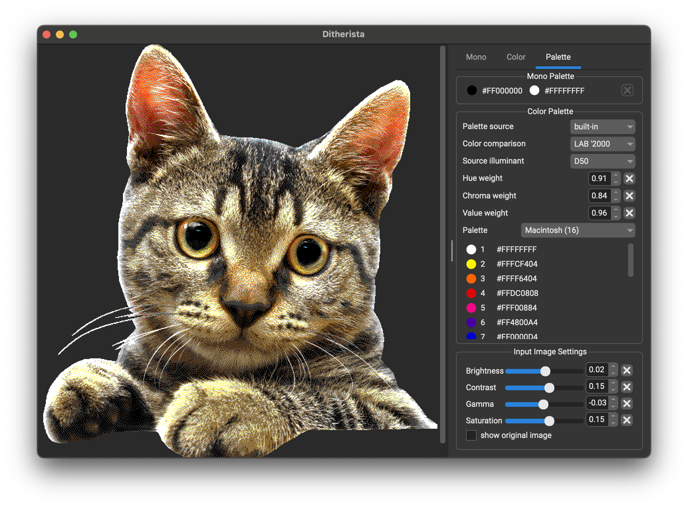
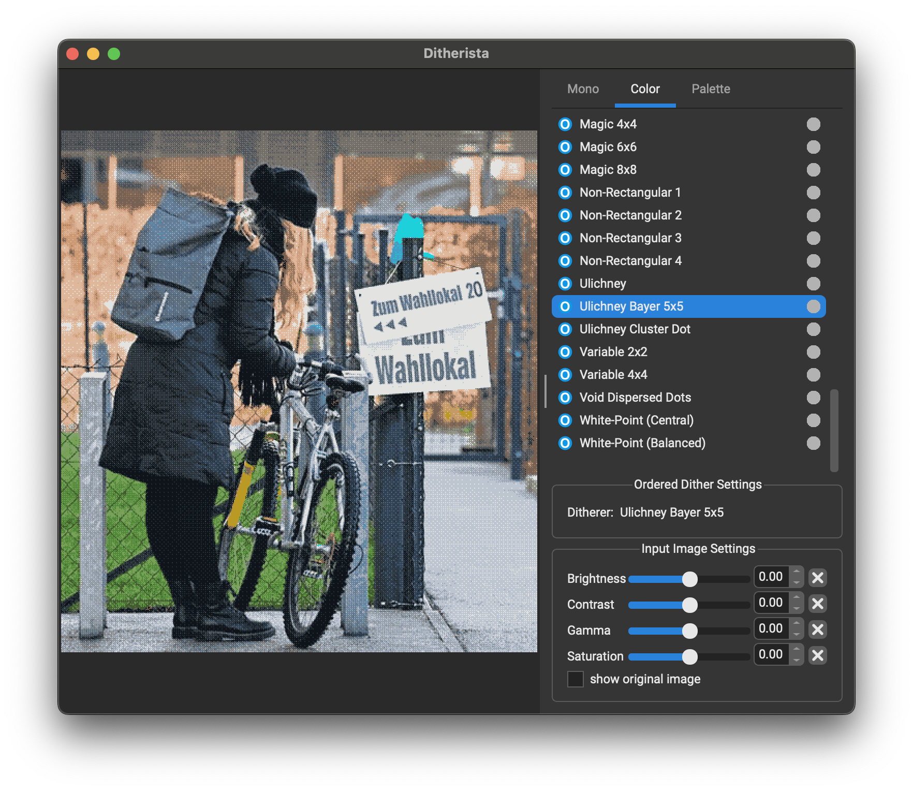

# Ditherista - A Ditherer for Windows, Linux and macOS


Ditherista is a small Windows, Linux and macOS GUI application for creating color and black-and-white dithered images.
It features easy import and export and over 90 different dithering methods.

Main interface on macOS:





### Downloads for Windows, macOS and Linux ###

Both Ditherista Color (lastest version) and Ditherista Mono (previous version) can be found here:
[Download from Github Releases](https://github.com/robertkist/ditherista/releases)

### Release Candidate ###

This version is a Release Candidate. It's fully functional, usable and generally stable. 

### Ditherista Features ###

* Over 90 different dither methods with adjustable parameters
* Import and export your files via drag & drop, copy & paste or via open and save file dialogs
* Adjust brightness, contrast, gamma and saturation
* Supports images with transparent background
* Edit palette colors for mono and color dithering or import custom palettes
* Available on Windows, macOS and Linux
* Performs calculations in linear color space for increased accuracy
* Supported image formats: PNG, JPG, BMP, GIF
* Support for HiDPI and Retina displays
* Many different dithering methods for color and mono
* Three different color quantization methods
* Many different color-matching methods

Known issues:
- In a few cases there may still be GUI glitches (incorrect resizing of UI elements)

Notes:
- LAB 2000 may look wrong if the reduced palette doesn't match the original image's palette well. This is not a bug -
  this is just how the LAB 2000 color matching works. Use the weight controls to tweak for better results!

Windows Installation
--------------------

Run the setup.exe file and follow its instructions. Shortcuts for launching the application will
be created automatically when running the setup.

When using the "msvc" version, you may have to install the latest [Microsoft Visual C++ 2015-2022 redistributable](https://aka.ms/vs/17/release/vc_redist.x64.exe) package.

macOS Installation
------------------

Double-click the .dmg and drag the Ditherista appliation into your system's Applications folder.
If you receive an error about the app being broken, please run the following command in the Terminal:

```
xattr -cr /Applications/Ditherista.app
```

Ubuntu Linux Installation
-------------------------

Either double click the .deb file to install it, or install via the command
```dpkg -i ditherista_setup.deb```. Ditherista supports HiDPI mode on linux, however, depending on
your display manager, it may not automatically recognize it. In this case, launching Ditherista via
`QT_SCREEN_SCALE_FACTOR=2 ./ditherista` may help.

Other Linux Installation
------------------------

Download the ```.AppImage```. Make the file executable and run it. You can use 
[AppImageLauncher](https://github.com/TheAssassin/AppImageLauncher) to integrate the Ditherista AppImage properly
into your desktop environment's Start menu or Application launcher.

Alternatively, you can download the ```.tar.gz``` package. This should include all dependencies. 
If they don't work, you can install package dependencies manually for your distribution:
* Ubuntu: ```apt install libgl1-mesa-dev libxcb-cursor-dev libxcb-cursor0 qt6-base libqt6svg6 qt6-qpa-plugins```
* Fedora: ```dnf install qt6-qtbase qt6-qtsvg```

Basic Usage
-----------

Tip: Also consult the built-in Help for instructions. 

Loading images:
  * Drag an image into the application from the Windows Exporer or macOS Finder.
  * You can also use copy and paste to load images.
  * Or use the File->Open... menu entry or the ```CTRL+O``` (Windows and Linux) / ```Command+O``` (macOS) keyboard 
    shortcuts.

Dithering an Image:
  * Pick any ditherer from the right hand side list.
  * Below the list you will see the selected ditherer's name and any options you can adjust.
  * On the bottom, you can adjust the source image's brightness, contrast and gamma. There
    is also an option to show the source image, so you can directly compare it with the 
    dither results.

Working with Palettes:
  * Right click on a color swatch to edit color and copy & paste them around to create custom paletters
  * You can load custom palettes from [lospec.com](https://lospec.com/) in Paint.NET format, which is a text based format, so you can also create and import your own palettes. 

Saving dithered images:
  * Drag them out of the viewport onto the Desktop or an open folder in the Windows Explorer of macOS Finder.
  * You can also use copy and paste to export the current dithered image.
  * Or use the File->Save and File->Save As... menu entries or the ```CTRL+S``` (Windows and Linux) / 
    ```Command+S``` (macOS) keyboard shortcuts.

Notes:
  * The largest image size supported is 4k by 4k resolution.
  * The DBS ditherer can take a few minutes or longer to calculate the dithered image on slow systems! However, smaller 
    images, like 512x512 are fairly quick to dither with DBS.
  * Dithered images will be cached, so they won't be re-calculated every time you switch ditherers. However, the
    cache will reset when you adjust the source image's gamma, brightness or contrast.
  * You can use the cursor keys to quickly move up and down the list of ditherers, or use the mouse wheel.
  * You can use the mouse wheel or the `-` and `+` keys (`=` also works for zooming in, which makes it more convenient 
    on US keyboards) to zoom the image in or out. Double clicking on the image or pressing `.` resets the zoom level.  

Building from Source
--------------------

All you need is a C++ compiler, Qt, and GNU make. There are no other dependencies for building the application.

Please refer to the [BUILDING.md](BUILDING.md) file for building on Windows, Linux and macOS.

Dithering Examples
------------------

Ditherista is powered by [libdither](https://github.com/robertkist/libdither) (from the same author).

Please visit the [libdither](https://github.com/robertkist/libdither) repo to see color and mono dithering examples.

